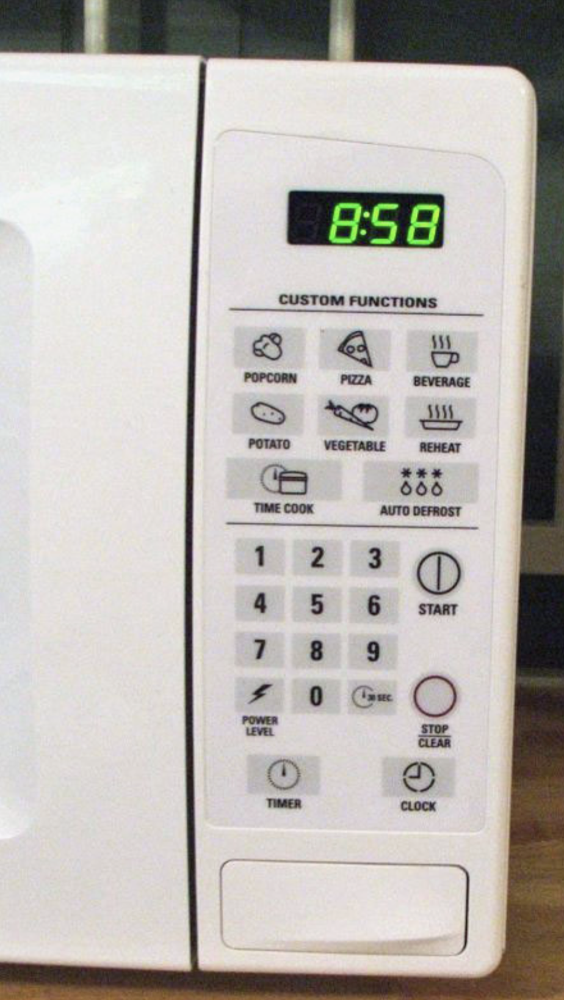
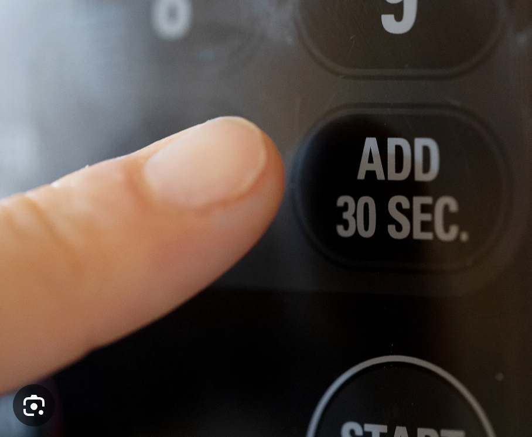

# People of the State v. Microwave

I use a microwave almost every day, and the experience is almost always seamless. However, I remember one microwave that turned a simple task into a frustrating process.

Microwaves should follow **affordance**, meaning their design should make it obvious how to use them. Buttons should be intuitive, and the process should be straightforward. But this microwave had other plans. Here is the microwave panel I recall dealing with:

 

I wanted to heat my food for 4 minute and 30 seconds. Normally, I’d press “4-3-0” and then “Start”. But as soon as I hit “4”, the microwave immediately started cooking for 4 seconds. I stopped it, tried again, and got the same result. Confused, I looked for a “Time Cook” button, found it, pressed it first, and entered my time. But when I hit “Start”, nothing happened.

After a few weeks, I was told I had to first enter the time, then press “Time Cook”, then press “Start”. Because of all my past encounters with microwaves, my **mental model** (how I expected it to work) did not align with this microwave's **conceptual model** (how it is actually designed). This mismatch led to frustration, and in the end, I gave up and resorted to spamming the +30 seconds button until I reached the time I wanted. It wasn’t what I originally planned, but at least I knew what to expect.

  

This was a **feedback** issue, when a system fails to indicate what is happening to the user. This microwave gave me no clue that pressing a number alone would start an automatic seconds timer. A simple message like “Enter Cooking Time” would have prevented this confusion.

Another problem was **consistency**. Most microwaves (and most devices in general) follow a logical sequence: you enter a value first, then confirm it. Phones work that way when dialing numbers. So do calculators. This microwave ignored that standard and forced me to learn its own way of doing things a standard microwave shouldn’t require.

A better design would:
- Display a prompt when numbers are entered, instead of assuming a quick start.
- Require confirmation before starting, rather than running with incomplete input.
- Follow a standard interface design that aligns with user expectations.

Microwaves should be seamless and standardized, not unexpected. This microwave could have added a simple message, saving me button spamming and confusion, but it instead looked the other way. Which is why I believe this microwave is guilty and should be granted no parole.
