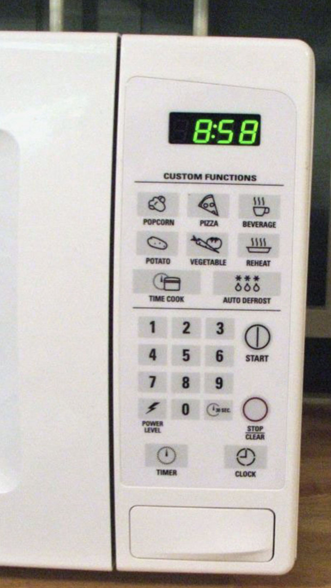
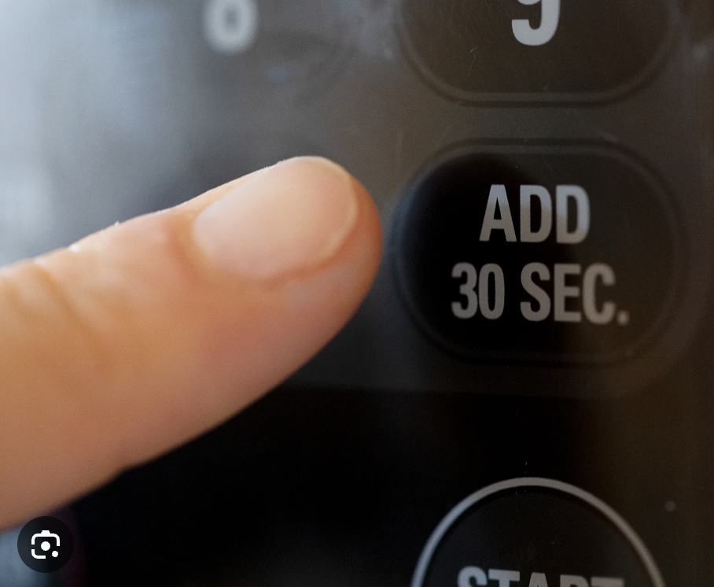

# People of the State v. Microwave

I use a microwave almost every day, and the experience is almost always seamless. However, I remember one microwave that turned a simple task into a frustrating process.

Microwaves should be designed with **affordance** in mind—meaning the physical design of buttons and labels should clearly suggest how they are meant to be used. A well-designed microwave should make it obvious what to press to start, stop, or set the time. But this microwave had other plans. Here is the microwave panel I recall dealing with:

 

I wanted to heat my food for 4 minutes and 30 seconds. Normally, I’d press “4-3-0” and then “Start”. But as soon as I hit “4”, the microwave immediately started cooking for 4 seconds. I stopped it, tried again, and got the same result. Confused, I looked for a “Time Cook” button, found it, pressed it first, and entered my time. But when I hit “Start”, nothing happened.

After a few weeks, I was told I had to first enter the time, then press “Time Cook”, then press “Start”. Because of all my past encounters with microwaves, my **mental model**—how I expected the microwave to behave based on my previous experience—did not align with this microwave's **conceptual model**—the way the microwave was actually designed to work. This mismatch led to frustration, and in the end, I gave up and resorted to spamming the +30 seconds button until I reached the time I wanted. It wasn’t what I originally planned, but at least I knew what to expect.

  

This was a clear **feedback** issue. In UX, **feedback** refers to how a system communicates its current state or responds to user input. This microwave gave me no clue that pressing a number alone would start an automatic seconds timer. A simple message like “Enter Cooking Time” would have prevented this confusion and helped me understand what was happening.

Another problem was **consistency**. Most devices—microwaves, phones, calculators—follow a predictable pattern: you input something first, then confirm the action. This microwave broke that pattern and forced me to learn its own logic, which made the experience more difficult than it needed to be.

A better design would:
- Display a prompt when numbers are entered, instead of assuming a quick start.
- Require confirmation before starting, rather than running with incomplete input.
- Follow a standard interface design that aligns with user expectations.

Microwaves should be seamless and standardized, not unexpected. This microwave could have added a simple message, saving me button spamming and confusion, but it instead looked the other way. Which is why I believe this microwave is guilty and should be granted no parole.
